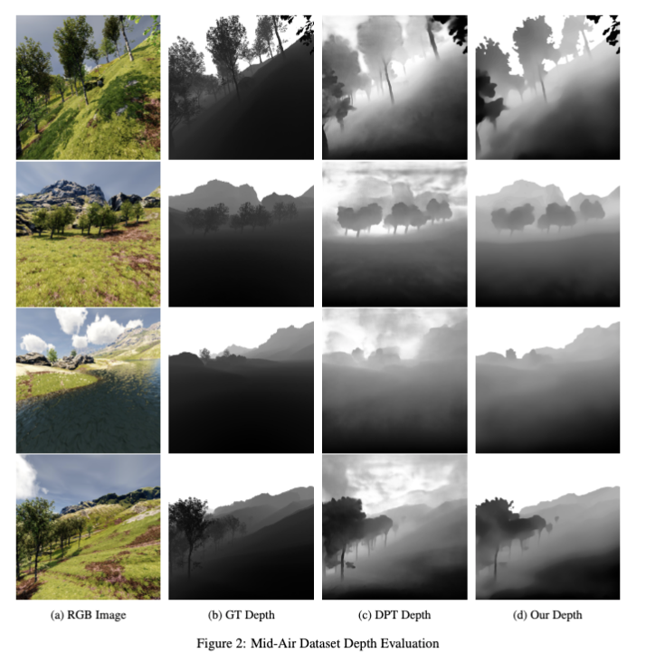

# SfMLearner with Transformer Depth Net
This repository builds on top of the [ClementPinard/SfmLearner-Pytorch](https://github.com/ClementPinard/SfmLearner-Pytorch) repository and replaces CNN based Depth-Net with DPT transformer network for more accurate depth estimation. For specifics related to the original repository, refer to it's README instead. This README talks about only the difference from the original and additional specifications.

Modified Pytorch implementation : Manasa Sathyan (msathyan@seas.upenn.edu), Swati Gupta (gswati@seas.upenn.edu)

## Preamble
This codebase was developed and tested with Pytorch 1.13.0, CUDA 11.7 and Debian GNU/Linux 10. T original code was developed in Pytorch 1.0.1.

## Prerequisite

```bash
pip3 install -r requirements.txt
```

or install manually the following packages :

```
pytorch >= 1.13.0
pebble
matplotlib
imageio
scipy
scikit-image
argparse
tensorboardX
blessings
progressbar2
path.py
```

### What has been done

* Training has been tested on MidAir Dataset
* There is a Dataset preparation step to store image sequences in folders prior to training, the data should be in the following structure:

```bash
midair_prepared/
  trajectory_0000/
    - 000000.JPEG
    - 000001.JPEG
    .
    .
    .
    - cam.txt
  trajectory_0001/
  trajectory_0018/
  .
  .
  .
  train.txt
  val.txt
```

Here,
* cam.txt inside each trajectory subfolder contains the camera intrinsic matrix for that trajectroy.
* train.txt and val.txt contain the split of train and test trajectories.

### Differences with Original SfmLearner Implementation

* CNN architecture for depth net has been replaced with a [DPT](https://github.com/isl-org/DPT) style architecture but with following key modification:
The network now outputs 4 different levels of depth maps (coarse to fine) instead of just one final map during training to facilitate better and faster training:
.png)


## Training
Once the data are formatted following the above instructions, you should be able to train the model either in original mode (no transformer) or with modification using the flag `--disp-transformer`, by running the following command

Original command:
```bash
python3 train.py /home/jupyter/midair_prepared/ -b4 -m0.2 -s0.1 --epoch-size 3000 --sequence-length 3 --log-output [--with-gt]
```

For training with transformer network (using pretrained weights is optional)
```bash
python3 train.py /home/jupyter/midair_prepared/ -b4 -m0.2 -s0.1 --epoch-size 3000 --sequence-length 3 --log-output --disp-transformer --pretrained-disp /home/jupyter/code/DPT/weights/dpt_hybrid_kitti-cb926ef4.pt  --pretrained-exppose checkpoints/midair_prepared\,epoch_size3000\,m0.2_cnn_model_bs4/11-19-00\:27/exp_pose_checkpoint.pth.tar
```

You can then start a `tensorboard` session in this folder by
```bash
tensorboard --logdir=checkpoints/
```
and visualize the training progress by opening [https://localhost:6006](https://localhost:6006) on your browser.


## Evaluation

Disparity/Depth map generation and metric evaluation can be done with `run_inference.py`
```bash
python3 run_inference.py --pretrained checkpoints/midair_prepared\,epoch_size3000\,m0.2_cnn_model_bs4/11-19-00\:27/dispnet_checkpoint.pth.tar --dataset-dir /home/jupyter/midair_prepared/ --output-dir midair_trained_inf_epsize3000_freeze --output-depth  --img-width=1024 --img-height=1024 --gt-dataset-dir /home/jupyter/MidAir/Kite_training/sunny/depth/
```

Pose evaluation is also available using `run_inference_pose.py`
```bash
python run_inference_pose.py --pretrained checkpoints/midair_prepared\,epoch_size3000\,m0.2_cnn_model_bs4/11-19-00\:27/exp_pose_checkpoint.pth.tar --dataset-dir /home/jupyter/midair_prepared/trajectory_0000/
```

**ATE** (*Absolute Trajectory Error*) is computed as long as **RE** for rotation (*Rotation Error*). **RE** between `R1` and `R2` is defined as the angle of `R1*R2^-1` when converted to axis/angle. It corresponds to `RE = arccos( (trace(R1 @ R2^-1) - 1) / 2)`.
While **ATE** is often said to be enough to trajectory estimation, **RE** seems important here as sequences are only `seq_length` frames long.

## Pretrained Nets

[Avalaible here](https://drive.google.com/drive/folders/1Z8qYcf2U5rDqmCXzpqxwBnAyo2Bt7LcS?usp=sharing)


### Depth Results on MidAir

| Abs Rel | Sq Rel | RMSE  | RMSE(log) |
|---------|--------|-------|-----------|
|  0.359  | 4.067  | 8.887 | 0.425     | 



### Pose Results on MidAir

3-frames snippets used

|    |                    |
|----|--------------------|
|ATE | 0.262 (std. 0.006) | 
|RE  | 0.083 (std. 0.007) |
